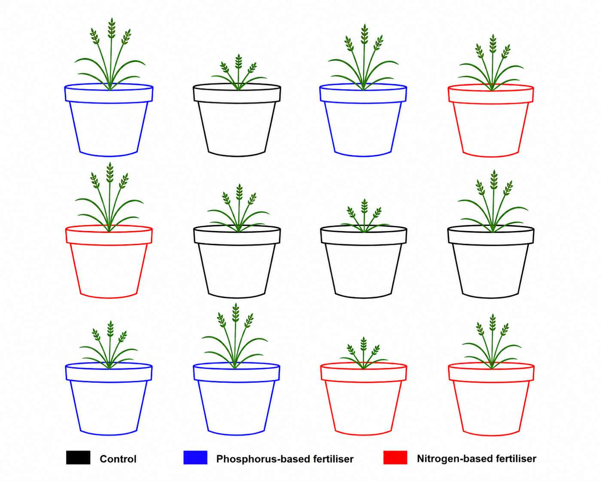

# What is ANOVA, Really ? {#sec-chap1}

## The variance decomposition idea

Imagine you are investigating whether the type of fertiliser applied to wheat plants affects how tall they grow. You have 12 identical pots of wheat seedlings. Four pots receive no fertiliser (control), four receive a nitrogen-based fertiliser, and four receive a phosphorus-based fertiliser. After six weeks, you measure the height of each plant.

Your starting assumption is that *there is no difference in mean plant height among  the three groups.* The alternative is that at least one fertiliser produces a different mean height.

Now consider the height of any single plant. Why does it differ from the average height of all 12 plants (we will call this average height the grand mean) ? There are two reasons.

**First**, that plant received a particular fertiliser, and that fertiliser may  genuinely promote or inhibit growth. This is what we will call the *treatment effect*. We use the term _treatment_ because the fertilier is what was applied to the plant, and _effect_ because it is the change in height that the fertiliser brings about.

**Second**, even plants given the same fertiliser will not grow identically. Tiny differences like seed quality, pot position, light exposure, and watering can make each plant slightly different from its neighbours. This uncontrollable scatter is what we will call *residual* or *error*. We use the term _residual_ because this second source of variation comes from all the factors that influence plant height but are not measurd in the experiment, they are leftover, the part of the story that the treament alone cannot tell.

The height of any single plant is therefore:

$$\text{Plant height} = \text{fertiliser effect} + \text{residual}$$

Suppose that we obtain the data below from the experiment:

| Treatment | Plant height (cm) |
|-----------|--------------|
| Control   | 4 |
| Control   | 5 |
| Control   | 2 |
| Control   | 1 |
| Nitrogen  | 10|
|Nitrogen | 8|
|Nitrogen|11|
|Nitrogen|7|
|Phosphorus|8|
|Phosphorus|4|
|Phosphorus|7|
|Phosphorus|5|

We have three groups of treatments: Control, Nitrogen, and Phosphorus. Each
treatment was *randomly* assigned to a plant.

### The Grand Mean and Group Means

Let us start with the bigger picture. By computing the mean of all 12 plant heights we obtain the **grand mean**:

$$\bar{x} = \frac{1}{n}\sum_{i=1}^{n} x_i
          = \frac{1}{12}(4 + 5 + 2 + 1 + 10 + 8 + 11 + 7 + 8 + 4 + 7 + 5)
          = 6 \text{ cm}$$

Computing the mean within each treatment group gives:

$$\bar{x}_{\text{control}} = \frac{1}{4}(4 + 5 + 2 + 1) = 3 \text{ cm}$$

$$\bar{x}_{\text{nitrogen}} = \frac{1}{4}(10 + 8 + 11 + 7) = 9 \text{ cm}$$

$$\bar{x}_{\text{phosphorus}} = \frac{1}{4}(8 + 4 + 7 + 5) = 6 \text{ cm}$$

Each group mean carries the effect of its treatment, but also the influence of any unmeasured factor like differences in seed quality, sunlight, watering, and so on. The nitrogen group mean of 9 cm, for example, reflects both the genuine effect of nitrogen fertiliser on growth *and* the small random differences that existed between those four plants regardless of what fertiliser they received.

### Among-Group Variation: The Signal

If we compare each group mean to the grand mean, the control sits 3 cm
*below* the grand mean ($\bar{x}_{\text{control}} = 3 \text{ cm} < \bar{x} = 6 \text{ cm}$), nitrogen sits 3 cm *above* it ($\bar{x}_{\text{nitrogen}} = 9 \text{ cm} > \bar{x} = 6 \text{ cm}$), and phosphorus sits right on it ($\bar{x}_{\text{phosphorus}} = 6 \text{ cm} = \bar{x} = 6 \text{ cm}$). 

Any displacement of a group mean from the grand mean can come from two sources: the effect of the treatment, and random error. 

- If fertiliser has no effect whatsoever, the three group means will cluster close to the grand mean, displaced only by chance. 

- If fertiliser genuinely matters, some means will be pulled far from the grand mean, and the spread among group means will be large. This spread is what we call **among-group variation**, and it is our window onto the treatment effect.

### Within-Group Variation: The Noise {#sec-within-group}

Now look inside each group. Even though all four plants in the control group received exactly the same treatment, no fertiliser at all, their heights (4, 5, 2, 1 cm) are not identical. This scatter cannot come from the fertiliser, since all four plants received the same one. It can only reflect the residual, the unmeasured sources of variation we discussed earlier. We can quantify this scatter with the within-group variance.
For the control group:

$$s^2_{\text{control}}
  = \frac{1}{n-1}\sum_{i=1}^{n}(x_i - \bar{x}_{\text{control}})^2$$
  
$$= \frac{(4-3)^2 + (5-3)^2 + (2-3)^2 + (1-3)^2}{3}
  = \frac{1 + 4 + 1 + 4}{3}
  = 3.33 \text{ cm}^2$$

This within-group scatter, present in every group regardless of which
fertiliser was applied, is our estimate of background noise i.e. the residual variation the experiment cannot control. This is what we call
**within-group variation**.

### The $F$ Ratio

We now have two variance estimates that tell very different stories: the among-group variance, which reflects the treatment effect plus noise, and the within-group variance, which reflects noise alone. The natural thing to do is form their ratio:

$$F = \frac{\text{Among-group variance (fertiliser + residual)}}
          {\text{Within-group variance (residual only)}}$$

When fertiliser has no effect, both the numerator and the denominator are estimating the same background noise, and their ratio will hover around 1.
As the true differences among fertilisers grow larger, the numerator grows, because the group means are being pulled further apart by the treatment, while the denominator stays anchored to the background noise. The ratio therefore climbs above 1, and the larger it becomes, the harder it is to believe that the differences among groups arose by chance alone.

### Assessing the $F$ Ratio: Is It Large Enough?

Knowing that $F$ is greater than 1 is not enough on its own, we need to know how much greater than 1 it would have to be before we can confidently say the differences are real. This is where probability comes in.

When there is truly no treatment effect, the $F$ ratio still varies from experiment to experiment simply due to chance. Mathematical statistics tells us that, under this condition, $F$ follows a known probability distribution called the **Fisher distribution** (or $F$-distribution), whose shape depends on the degrees of freedom of the two variance estimates. This distribution acts as a reference: it tells us exactly how large $F$ would typically be if there were no fertiliser effect at all.

In practice, we choose a threshold probability in advance, conventionally $\alpha = 0.05$, which defines a critical value of $F$. If our observed $F$ exceeds this critical value, it means that the probability of seeing a ratio this large by chance alone is less than 5%. We then conclude that the differences among fertiliser groups are unlikely to be due to chance.

If our observed $F$ does not reach the critical value, we do not have sufficient evidence to rule out chance as an explanation.

This is the core logic of the ANOVA test, and as we will see in the
next section, it is also the core logic of a much broader family of
statistical models.

## A Brief History of ANOVA

### Origins in Agriculture

The analysis of variance was developed in the early twentieth century by the  British statistician and geneticist Ronald A. Fisher, widely regarded as the  founder of modern statistics. Fisher developed the method during his time at  the Rothamsted Experimental Station in Hertfordshire, England, where he worked  from 1919 to 1933 [@fisher1919xv]. Rothamsted was, and remains, one of the  oldest agricultural research institutions in the world, and it was here that Fisher was confronted with a practical problem: how to make sense of large  volumes of messy experimental data on crop yields, soil treatments, and  fertiliser effects.

The core challenge was not merely computational but conceptual. Agricultural  field experiments are inherently noisy. Soil fertility varies across a field,  weather is unpredictable, and individual plants differ in ways that cannot be  controlled. Fisher needed a principled way to separate the variation caused by  experimental treatments, different fertilisers, crop varieties, tillage methods, from the background variation that existed regardless of what the experimenter  did. His solution was the decomposition of total variance into distinct,  interpretable components: a idea that became the conceptual backbone of ANOVA  [@fisher1970statistical].

### The Key Publications

Fisher first introduced the F statistic and the logic of variance decomposition  in his landmark 1925 textbook *Statistical Methods for Research Workers*  [@fisher1970statistical]. This work presented ANOVA not as an abstract mathematical  construction but as a practical tool for scientists, illustrated throughout with  agricultural and biological examples. The book went through fourteen editions  over Fisher's lifetime and was enormously influential in spreading statistical  thinking across the life sciences.

Fisher elaborated the theory further in *The Design of Experiments*, published  in 1935 [@fisher1935design]. This second major work introduced the principles of randomisation, replication, and blocking that underpin valid experimental design to this day, and showed how ANOVA was inseparable from the way an experiment should be planned. The famous example of the lady tasting tea, introduced in this book, illustrated the logic of hypothesis testing in a way that remains a  staple of introductory statistics courses.

### The $F$ Statistic

The ratio of variances that lies at the heart of ANOVA, what we now call the $F$ statistic, was named in Fisher's honour by George W. Snedecor, the American statistician who popularised and extended Fisher's methods in the United States  [@snedecor1934]. Snedecor introduced the notation $F$ explicitly as a tribute, and the name has remained standard ever since.

### From Agriculture to All of Science

Although ANOVA was born from the needs of agricultural research, its logic proved universal. By the mid-twentieth century it had been adopted across medicine, psychology, ecology, and engineering, wherever researchers needed to compare means across multiple groups while accounting for background noise. Today it remains one of the most widely used statistical procedures in empirical science [@montgomery2017design].

The enduring power of ANOVA lies precisely in the simplicity of the idea Fisher identified at Rothamsted: that variation is not an obstacle to understanding, but a quantity that can be measured, partitioned, and interpreted.

## ANOVA as a Special Case of Linear Models

### The Linear Model Idea

You may have already encountered simple linear regression: the idea that you can predict one variable from another using a straight line. For example, you might predict plant height from the amount of rainfall received. The equation looks like this:

$$\text{Plant height} = \beta_0 + \beta_1 \times \text{Rainfall} + \varepsilon$$

where $\beta_0$ is the intercept (the expected height when rainfall is zero),  $\beta_1$ is the slope (how much height changes for each additional unit of  rainfall), and $\varepsilon$ is the error, the residual scatter around the line that rainfall alone cannot explain.

This is called a **linear model**: we are modelling the response variable (plant height) as a linear combination of some predictor plus error.

**ANOVA is in fact the same thing**. The only difference is that instead of a  continuous predictor like rainfall, _our predictor is a categorical variable_ that is variable with group label like *control*, *nitrogen*, or *phosphorus*. 

### Recoding Groups as Numbers: Dummy Variables

A computer cannot do arithmetic on the words "control" or "nitrogen", so we  recode the group labels as numbers. This is done using **dummy variables**  (also called indicator variables). The idea is simple: we pick one group as  the reference, say, the control, and then create one dummy variable for each  of the other groups.

For our fertiliser experiment with **three groups**, we create **two dummy variables**:

$$X_1 = \begin{cases} 1 & \text{if the plant received nitrogen} \\ 
0 & \text{otherwise} \end{cases}$$

$$X_2 = \begin{cases} 1 & \text{if the plant received phosphorus} \\ 
0 & \text{otherwise} \end{cases}$$

Notice that a control plant gets $X_1 = 0$ and $X_2 = 0$: it is identified by the absence of both flags. **We never need a third dummy variable for the control group because it is already fully described this way.**

The table below shows how the 12 plants in our experiment are recoded:

| Plant | Group      | $X_1$ (nitrogen) | $X_2$ (phosphorus) |
|-------|------------|:-----------------:|:------------------:|
| 1     | Control    | 0                 | 0                  |
| 2     | Control    | 0                 | 0                  |
| 3     | Control    | 0                 | 0                  |
| 4     | Control    | 0                 | 0                  |
| 5     | Nitrogen   | 1                 | 0                  |
| 6     | Nitrogen   | 1                 | 0                  |
| 7     | Nitrogen   | 1                 | 0                  |
| 8     | Nitrogen   | 1                 | 0                  |
| 9     | Phosphorus | 0                 | 1                  |
| 10    | Phosphorus | 0                 | 1                  |
| 11    | Phosphorus | 0                 | 1                  |
| 12    | Phosphorus | 0                 | 1                  |

Notice the pattern: each group has its own "signature" of zeros and ones. The control group is the only group with zeros in *both* columns, which is why it serves naturally as the reference against which the other groups are compared.

### Writing the model

We can now write the ANOVA as a linear model:

$$\text{Plant height} = \beta_0 + \beta_1 X_1 + \beta_2 X_2 + \varepsilon$$

The coefficients have a beautifully simple interpretation:

- $\beta_0$ is the mean height of the **control** group (when $X_1 = 0$ and $X_2 = 0$).

- $\beta_1$ is the **difference** in mean height between the nitrogen group and the control group.

- $\beta_2$ is the **difference** in mean height between the phosphorus group and the control group.

- $\varepsilon$ is the residual error for each individual plant.

Let us check this with a concrete example. Suppose the estimated coefficients are:

$$\hat{\beta}_0 = 20 \text{ cm}, \quad \hat{\beta}_1 = 5 \text{ cm}, 
\quad \hat{\beta}_2 = 2 \text{ cm}$$

Then the model predicts:

- A **control** plant: $20 + 5 \times 0 + 2 \times 0 = 20$ cm
- A **nitrogen** plant: $20 + 5 \times 1 + 2 \times 0 = 25$ cm
- A **phosphorus** plant: $20 + 5 \times 0 + 2 \times 1 = 22$ cm

In other words, nitrogen fertiliser is associated with plants that are on  average 5 cm taller than the control, and phosphorus with plants that are  2 cm taller.

### The connection to the $F$ test

In the linear model framework, the null hypothesis of ANOVA,  *no difference in mean height among groups*, translates directly into:

$$H_0: \beta_1 = 0 \quad \text{and} \quad \beta_2 = 0$$

That is, we are testing whether all the group coefficients are simultaneously zero. If they are, then the group labels carry no information and the model reduces to:

$$\text{Plant height} = \beta_0 + \varepsilon$$

which simply says every plant has the same expected height (the grand mean) plus noise. **The $F$ test in ANOVA is exactly the test of this hypothesis: it  compares how much better the full model (with group labels) fits the data  compared to this reduced model (with no group labels).** A large $F$ means the group labels explain a meaningful amount of the variation in height, and we reject $H_0$.

### Why Does This Matter?

Recognising ANOVA as a linear model is more than a mathematical curiosity. It means that **ANOVA and regression are not two separate tools you need to learn independently, they are both special cases of a single unified framework, the general linear model**. Once you are comfortable with this framework, you can naturally extend your analyses to situations that mix categorical and continuous predictors (called ANCOVA), include multiple categorical factors (two-way ANOVA), or handle more complex experimental designs, all within exactly the same logic you have already learned here.

## What ANOVA is **not**: Common Misconceptions

### ANOVA Does Not Tell You Which Groups Differ

This is perhaps the most common source of confusion among newcomers. A significant $F$ test tells you that the group means are not all equal i.e that somewhere among your groups there is a real difference. It does not tell you *where* that difference lies.

In our fertiliser example, a significant result tells you that fertiliser type matters, but it does not tell you whether nitrogen differs from the control, whether phosphorus differs from the control, or whether nitrogen and phosphorus differ from each other. Identifying which specific pairs of groups differ requires additional **post-hoc tests**, such as Tukey's HSD or pairwise $t$-tests with corrected significance thresholds, which are conducted after the ANOVA, and only when the $F$ test is significant.

### A Non-Significant Result Does Not Mean the Groups Are Equal

If your $F$ test returns $p > 0.05$, it is tempting to conclude that the  fertilisers have no effect on plant height. **This conclusion is not warranted.**  A non-significant result means only that *you did not find sufficient evidence of a difference given your data*. There are many reasons this can happen even when a true difference exists:

- Your sample size may have been too small to detect a modest effect.
- The within-group variation (error) may have been large, drowning out a  real treatment signal.
- The effect of the treatment may be genuine but smaller than your experiment  was designed to detect.

**The absence of evidence is not evidence of absence.** A non-significant ANOVA should prompt you to think about the **statistical power** of your experiment: its ability to detect an effect of a given size, rather than to simply accept the null hypothesis.

### ANOVA Does Not Require Equal Sample Sizes, But Imbalance Has Consequences

It is a common belief that ANOVA requires the same number of observations in each group. This is not strictly true: ANOVA can be performed on unbalanced designs where group sizes differ. However, equal sample sizes are strongly preferred. Balanced designs are more statistically efficient, more robust to violations of the assumption of equal variances, and considerably simpler to interpret. If your groups are very unequal in size, the results of the $F$ test can become sensitive to assumptions you might not have checked carefully.

### ANOVA is not robust to all assumption violations

ANOVA rests on three key assumptions:

1. **Independence**: the observations are independent of one another.
2. **Normality**: the residuals (errors) are approximately normally distributed within each group.
3. **Homogeneity of variance**: the variance within each group is approximately the same (also called homoscedasticity).

Students sometimes assume that ANOVA is so widely used that it must be safe to apply in any situation. **This is not the case**. Of the three assumptions above, independence is by far the most critical. Violating it, for example by measuring the same plant twice and treating the two measurements as independent observations, can severely inflate your false positive rate and lead to entirely spurious conclusions. Violations of normality are generally less serious, especially with larger sample sizes, thanks to the central limit theorem. Violations of homogeneity of variance are intermediate in severity and can be addressed with modified versions of the test, such as Welch's ANOVA.

We will explore the assumptions of ANOVA in the following chapter.

### ANOVA is Not a Test of Means Alone

Although ANOVA is typically introduced as a way to compare means, what it actually does is partition and compare *variances*. The $F$ ratio is a ratio of two variance estimates, not a direct comparison of means. The connection to means is real, a large among-group variance arises precisely because the group means are far apart, but it is important to understand that ANOVA is fundamentally a test about the structure of variation in your data. This is why, as we saw in the previous section, ANOVA fits so naturally within the linear model framework: both are concerned with explaining variation, not merely comparing averages.

### ANOVA is not a Substitute for Good Experimental Design

Finally, and perhaps most importantly, no statistical test can rescue a poorly designed experiment. ANOVA assumes that your groups were formed by proper randomisation, that your replicates are genuine independent observations, and that sources of systematic bias have been controlled or accounted for. If your four control plants were all placed on one side of the greenhouse and your four nitrogen plants on the other, then any difference you observe might reflect a light or temperature gradient rather than a fertiliser effect. ANOVA will dutifully compute an $F$ statistic and a $p$-value in this situation, but the result will be meaningless. As Fisher himself understood from his years at Rothamsted, the validity of the analysis begins not at the computer but at the moment the experiment is designed.